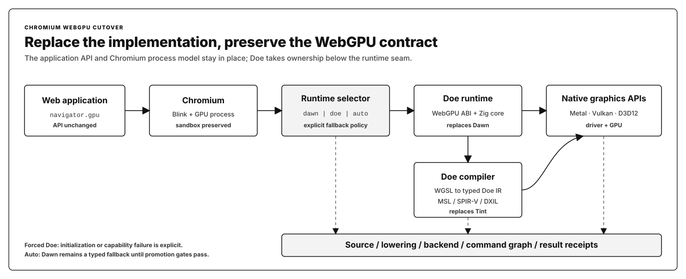
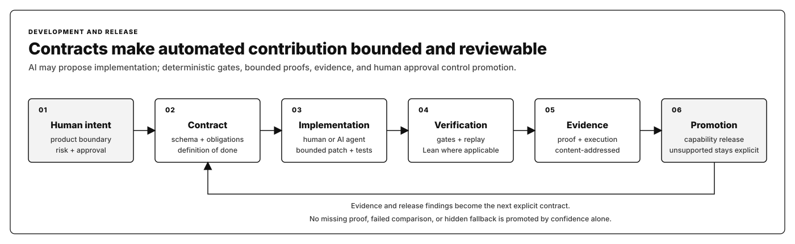

# Doe

<p align="center">
  
</p>

<p align="center">
  <a href="https://github.com/doerun/doe/actions/workflows/webgpu-package-surface.yml"></a>
  <a href="https://www.npmjs.com/package/doe-gpu"></a>
  <a href="https://github.com/doerun/doe/blob/main/LICENSE"></a>
  <a href="https://github.com/doerun/doe/pulls"></a>
</p>

Doe is an independent, source-preserving WebGPU runtime and WGSL compiler
written in Zig. Its browser target is precise: replace the Dawn runtime and Tint
compiler underneath `navigator.gpu` without changing the WebGPU API that
applications use.

The replacement is not the public browser API. It is the implementation behind
that API: object lifecycle, validation, shader compilation, command encoding,
queue execution, native backend lowering, and the evidence that identifies what
actually ran.

## Why Doe

Dawn and Tint are mature, production-proven systems built for Chromium's broad
graphics, platform, and compatibility requirements. They also live inside a
large, layered browser toolchain with historical integration boundaries that a
general-purpose implementation must preserve.

Doe explores a different engineering shape: a focused team owns the runtime,
compiler, backend lowering, proofs, benchmarks, and release evidence as one
coherent system. Zig is an enabling choice, not the whole argument. The larger
goal is a WebGPU stack that is easier to build as explicit artifacts, specialize
for stable compute graphs, inspect from source to result, and retarget without
losing program identity.

| Dimension | Dawn and Tint context | Doe design goal |
| --- | --- | --- |
| Product boundary | A mature WebGPU implementation and shader compiler serving Chromium-scale platform breadth | One independently owned runtime-and-compiler path beneath the same WebGPU API |
| Implementation shape | Established C++ subsystems, generated interfaces, and browser integration layers | A compact Zig native core with explicit ABI, compiler IR, backend, and package boundaries |
| Build and release | Integrated with a large multi-toolchain browser ecosystem | Reproducible, content-addressed runtime, compiler, package, and browser-lane artifacts |
| Correctness | Extensive production validation, tests, and conformance coverage | Tests and conformance plus bounded Lean proofs and replayable source-to-result receipts |
| Evolution | Broad compatibility changes coordinated across mature subsystems | Contract-bounded changes that humans and automated contributors can implement and verify end to end |

Doe does not claim that a smaller or newer implementation is automatically
better. It must demonstrate compatibility, correctness, reliability, and speed
on each promoted surface. Dawn and Tint remain the comparison baseline and the
explicit browser fallback until those gates pass.

## How replacement works



1. **Preserve the application contract.** Web applications continue to call
   `navigator.gpu`; Blink, Chromium's renderer behavior, GPU-process boundary,
   and sandbox model remain in place.
2. **Select the runtime explicitly.** Chromium chooses `dawn`, `doe`, or
   governed `auto` mode. Forced-Doe runs fail closed when Doe cannot initialize;
   they cannot silently become Dawn evidence.
3. **Replace Dawn at the WebGPU implementation seam.** Chromium loads Doe's
   WebGPU-compatible C ABI and procedure table. The Zig runtime owns WebGPU
   objects, resources, pipelines, encoders, queues, synchronization, and the
   supported browser interop surface.
4. **Replace Tint in shader creation.** Doe preserves WGSL, parses and validates
   it, lowers it to a shared typed IR, and emits MSL, SPIR-V, or DXIL for the
   selected native backend. A forced-Doe path does not ask Tint to compile the
   shader.
5. **Bind execution to evidence.** Hash-linked receipts identify the browser,
   runtime selector, source, compiler lowering, backend artifact, adapter,
   effective options, fallback state, command graph, timing, and result.

This architecture lets Doe hoist stable validation and lowering decisions out
of repeated execution, prepare known graphs deliberately, make unsupported
behavior explicit, and preserve the same program identity when targeting Metal,
Vulkan, D3D12, or a different accelerator architecture.

> **Current boundary:** the native runtime, compiler, npm package, drop-in ABI,
> selector contracts, and evidence machinery exist at different promotion
> levels. The forced-Doe Chromium browser release is still a governed target,
> not a shipped universal replacement. `doe-gpu/browser` currently wraps the
> browser's incumbent `navigator.gpu` implementation.

## Built for contract-driven development



Doe treats a contract as an executable definition of work, not only prose. A
contract can define an API surface, lifecycle rule, backend capability, failure
taxonomy, fixture set, trace field, comparison obligation, proof requirement,
and release gate. That structure is intended to support bounded automatic
implementation:

1. A human chooses product intent and approves the contract.
2. A human or AI agent implements one declared obligation and its positive and
   negative tests.
3. Deterministic schema, ABI, behavior, conformance, trace, replay, and benchmark
   gates evaluate the change.
4. Lean 4 discharges selected proof obligations where mathematical evidence can
   justify a safety rule or optimization. Doe does not claim whole-system formal
   verification.
5. The build emits content-addressed proof and execution artifacts.
6. A capability is promoted only when its required evidence is present; an
   unproven platform or path remains diagnostic or unsupported.

AI output is therefore proposed implementation, not release authority. The
contracts define the boundary, deterministic tools test it, Lean checks bounded
theorems, and humans retain control of intent and promotion. The existing
[Lean pipeline](pipeline/lean/STYLE.md) already generates a comparability
contract, records theorem and input hashes, and exposes proof artifacts to the
Zig build; extending this pattern to more compiler and runtime obligations is
the forward path.

## Targets and promotion rule

Doe has two targets: replace Dawn and Tint in Chromium-family WebGPU, and
retarget closed Program Bundles to backends such as SPIR-V and CSL (Cerebras)
without losing program identity. Performance, compatibility, and replacement
language promotes only after comparable receipts pass their gates. The
[replacement frontier](config/dawn-replacement-frontier.json) records the
remaining browser, runtime, compiler, and platform blockers.

## Surfaces

| Surface | Current boundary |
| --- | --- |
| [`doe-gpu`](packages/doe-gpu/README.md) | Public npm package for Node, Bun, and Deno. Its `browser` subpath wraps the browser's incumbent WebGPU implementation. |
| Native runtime | `doe-zig-runtime` and `libwebgpu_doe` drive repo development, governed comparisons, and lane-specific drop-in artifacts. They are not a universal runtime release. |
| Fawn/Chromium | Repo-only browser integration and diagnostics. The claim index does not yet contain a public Doe browser release. |
| Compiler and lowering | The WGSL compiler emits backend artifacts for Metal, SPIR-V/Vulkan, and DXIL/HLSL. Doppler bundles currently reach normalized execution and HostPlan/CSL. Unsupported contracts fail explicitly. |

Public performance wording comes from claim-indexed rows in
[`reports/claim-index.json`](reports/claim-index.json) and their receipt
sidecars. The browser-release row remains scaffolded; promotion requires a real
HTTPS archive, provenance, proof surface, launch receipt, and platform-specific
comparisons.

## Execution paths

```text
WGSL source ----------> WGSL IR + emitters -------> Metal | SPIR-V | DXIL

Doppler Program Bundle -> normalized execution -+-> WebGPU executor
                                                +-> HostPlan | CSL

input + lowering + backend + result identities ---> receipts -> gates
                                                              -> claim index
```

## Build

Install the public package:

```bash
npm install doe-gpu
```

Build the native lane from source with Zig 0.15.2 and Node.js 18+:

```bash
git clone https://github.com/doerun/doe.git
cd doe
cd runtime/zig
zig build dropin
cd ../..
node packages/doe-gpu/scripts/build-addon.js
node packages/doe-gpu/test/smoke/test-smoke-load.js
```

The smoke command checks load and export wiring without requiring a GPU.

## Evidence

| Backend | Surface or workload | Comparator | Result | Evidence state | Evidence |
| --- | --- | --- | --- | --- | --- |
| Apple Metal | Native strict | Dawn | Indexed receipt; lower is better | Claim-indexed | [Claim index](reports/claim-index.json) |
| Apple Metal | Native release | Dawn | Indexed release receipt; lower is better | Claim-indexed | [Claim index](reports/claim-index.json) |
| Apple Metal | Package, Node and Bun | Host WebGPU | Node and Bun package receipts | Claim-indexed | [Claim index](reports/claim-index.json) |
| Apple Metal | ORT, Node, Bun, and browser | Host WebGPU or Dawn | Diagnostic inference receipts | Diagnostic | [Claim index](reports/claim-index.json) |
| AMD Vulkan | Native release | Dawn | Indexed release matrix; lower is better | Claim-indexed | [Claim index](reports/claim-index.json) |
| AMD Vulkan | Package, Node and Bun | Host WebGPU | Package evidence must be regenerated | Scaffolded | [Claim index](reports/claim-index.json) |
| Linux Vulkan | Drop-in cutover | Dawn ABI | Fresh rehearsal evidence is missing | Scaffolded | [Claim index](reports/claim-index.json) |
| Intel Tiger Lake Vulkan | Workgroup atomic, 100 dispatches | Dawn | p50 Doe/Dawn: 83.769/132.326 ms (1.58×); p95: 84.285/134.995 ms (1.60×) | Local compute row passes; combined report diagnostic | [Tiger Lake status](docs/status/runtime-backends-and-bench.md) |
| Intel Tiger Lake Vulkan | Workgroup non-atomic, 100 dispatches | Dawn | p50 Doe/Dawn: 83.569/132.907 ms (1.59×); p95: 84.160/138.258 ms (1.64×) | Local compute row passes; combined report diagnostic | [Tiger Lake status](docs/status/runtime-backends-and-bench.md) |
| D3D12 | Native | Dawn | Fresh Windows and mapping evidence is missing | Scaffolded | [Claim index](reports/claim-index.json) |

Tiger Lake timings list Doe first and Dawn second. They are selected operation
totals for one command containing 100 dispatches; lower is better, and the ratio
is Dawn time divided by Doe time. Both compute rows pass strict comparability
and local claim evaluation. The combined local report remains diagnostic
because its separate render-bundle row is non-comparable, so the Tiger Lake
result is not claim-indexed as a general Vulkan or browser claim.

Raw public timings remain in the artifacts referenced by the
[claim index](reports/claim-index.json). Local Tiger Lake receipt locations and
their current boundary are recorded in the linked status shard.

The [support matrix](docs/doe-support-matrix.md) records the broader platform
and surface inventory.

## Start here

| Reader | Entry points |
| --- | --- |
| Package users | [`packages/doe-gpu/README.md`](packages/doe-gpu/README.md), [`docs/package-model.md`](docs/package-model.md) |
| Runtime contributors | [`runtime/zig/README.md`](runtime/zig/README.md), [`docs/architecture.md`](docs/architecture.md), [`docs/status.md`](docs/status.md) |
| Compiler contributors | [`docs/shader-compiler-architecture.md`](docs/shader-compiler-architecture.md), [`docs/doppler-ingest.md`](docs/doppler-ingest.md), [`docs/tsir-lowering-plan.md`](docs/tsir-lowering-plan.md), [`docs/status/tsir.md`](docs/status/tsir.md) |
| Evidence reviewers | [`bench/README.md`](bench/README.md), [`docs/process.md`](docs/process.md), [`docs/claim-discipline.md`](docs/claim-discipline.md), [`reports/claim-index.json`](reports/claim-index.json) |

License details: [`docs/licensing.md`](docs/licensing.md).
