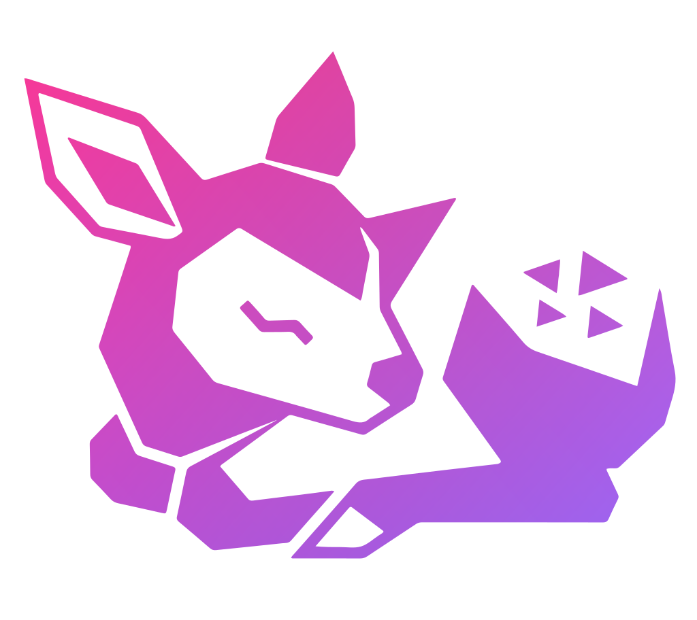
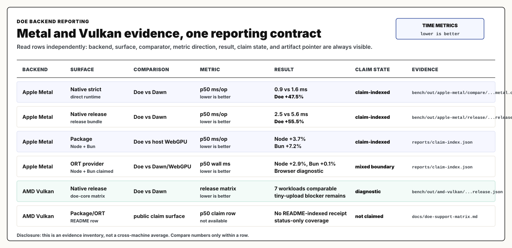

# Doe

<p align="center">
  
</p>

Doe is a source-preserving accelerator runtime and compiler. It keeps shader and
program bodies inspectable, lowers them across execution targets, and writes
receipts for what ran.

Doe has two active surfaces:

- A local WebGPU/runtime path for native, browser, Node, and Bun workloads.
- A compiler path for model systems such as Doppler, where model programs can be
  lowered through Doe IR toward backends such as Cerebras.

Published npm surface: [`packages/doe-gpu/README.md`](packages/doe-gpu/README.md).

## What it is

- `doe-gpu`: JavaScript package entry point for WebGPU-backed workloads.
- `doe-zig-runtime` and `libwebgpu_doe`: native WebGPU runtime surfaces used by
  strict and release comparison lanes.
- `runtime/zig/src/doe_wgsl`: WGSL lowering and backend emission work.
- `pipeline/trace`, `pipeline/lean`, and `bench`: trace, checking, and benchmark
  receipt surfaces.
- Doppler ingest and Cerebras path: model bundle ingest, TSIR/HostPlan lowering,
  CSL emission, and emulator receipts.

## How it works

1. Workloads enter as source-visible WGSL, IR, or model-plan contracts.
2. Config selects the backend and comparability rules.
3. Doe lowers and executes the workload, or rejects unsupported contracts.
4. Bench and trace tools emit receipts.
5. Public claims point at receipt artifacts instead of prose-only summaries.

## Benchmark evidence

The README chart uses one reporting contract across backends: each row states
backend, surface, comparator, metric direction, result, claim state, and
evidence path. Metal rows are public claim-indexed rows; Vulkan rows are shown
with their current diagnostic/status boundary instead of being omitted.



See [`reports/claim-index.json`](reports/claim-index.json) for the public claim
index and [`bench/out`](bench/out) for receipt payloads. Backend support status
and claim boundaries are tracked in
[`docs/doe-support-matrix.md`](docs/doe-support-matrix.md).

## Start here

- Package consumers: [`packages/doe-gpu/README.md`](packages/doe-gpu/README.md)
- Runtime contributors: [`runtime/zig/README.md`](runtime/zig/README.md)
- Benchmarks and evidence: [`bench/README.md`](bench/README.md)
- Current status and claim boundaries: [`docs/status.md`](docs/status.md)
- Chromium WebGPU strategy:
  [`docs/chromium-webgpu-task-list.md`](docs/chromium-webgpu-task-list.md)
- Doppler Program Bundle ingest: [`docs/doppler-ingest.md`](docs/doppler-ingest.md)
- Cerebras lane: [`docs/cerebras.md`](docs/cerebras.md)
- TSIR compiler work:
  [`docs/tsir-lowering-plan.md`](docs/tsir-lowering-plan.md),
  [`docs/loop-protocol.md`](docs/loop-protocol.md), and
  [`docs/status/tsir.md`](docs/status/tsir.md)
- Project rationale and boundaries: [`docs/thesis.md`](docs/thesis.md),
  [`docs/architecture.md`](docs/architecture.md), and
  [`docs/process.md`](docs/process.md)
- Proof and trace pipeline: [`pipeline/lean/README.md`](pipeline/lean/README.md),
  [`pipeline/trace/README.md`](pipeline/trace/README.md), and
  [`pipeline/agent/README.md`](pipeline/agent/README.md)

## Quick start

Requirements:

- Zig 0.15.2
- Node.js 18+

```bash
git clone https://github.com/doerun/doe.git
cd doe
zig build dropin
node packages/doe-gpu/scripts/build-addon.js
node packages/doe-gpu/test/smoke/test-smoke-load.js
```

That smoke path checks load and export wiring without requiring a GPU.

## Legacy package names

These legacy package names are deprecated in favor of `doe-gpu`:

- `@simulatte/webgpu`
- `@simulatte/webgpu-doe`

## License

See [`docs/licensing.md`](docs/licensing.md).
